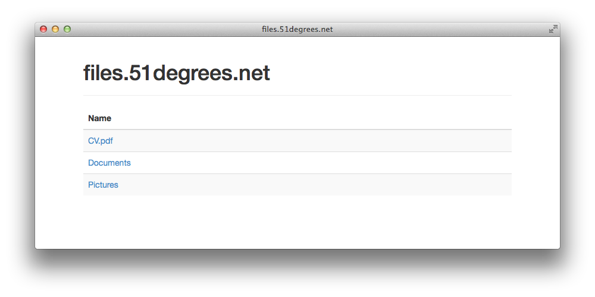

baketto
=======

A simple, private S3 browser.

The recent S3 price reductions have made it much more feasible, as a consumer, to use it for large backups. I wanted a simple, private browser for a particular bucket, that I could run on Heroku and download files using authenticated links.

## Screenshot

## Install

Clone the source (or fork and clone, if you want to customise it).

    git clone git@github.com:olly/baketto.git
    cd backetto

Create a heroku application and deploy.

    heroku apps:create --region eu <APP_NAME>
    git remote add heroku git@heroku.com:<APP_NAME>.git

Configure your application. It's recommended to use credentials restricted using IAM. See: [Configuring IAM](#configuring-iam). You might also want to consider setting some of the optional configuration options.

    heroku config:set \
      AUTH_USER=<YOUR_AUTH_USER> \
      AUTH_PASSWORD=<YOUR_AUTH_PASSWORD> \
      AWS_ACCESS_KEY_ID=<YOUR_AWS_ACCESS_KEY_ID> \
      AWS_SECRET_ACCESS_KEY=<YOUR_AWS_SECRET_ACCESS_KEY> \
      AWS_REGION=<YOUR_BUCKETS_REGION> \
      BUCKET_NAME=<YOUR_BUCKET_NAME>

## Config

* `AUTH_USER` _(required)_ – the username for digest authentication
* `AUTH_PASSWORD` _(required)_ – the password for digest authentication
* `AWS_ACCESS_KEY_ID` _(required)_ – the AWS Access Key ID to access the specified bucket
* `AWS_SECRET_ACCESS_KEY` _(required)_ – the AWS Secret Access Key to access the specified bucket
* `AWS_REGION` _(required)_ - the region where the bucket is located
* `BUCKET_NAME` _(required)_ – the name of the bucket to browse
* `HOST` _(optional)_ – used for presentational purposes and as the realm for digest authentication. Uses `BUCKET_NAME` if not specified
* `SECRET_KEY` _(optional)_ – used for digest authentication. If not specified it will use a random key, but this will prevent your browser from remembering credentials each time the server restarts

## Security

### Configuring IAM

1. Login to the AWS Management Console
2. Select the IAM Service
3. Select "Users" => "Create New Users"
4. Enter a username, and ensure "Generate an access key for each User" is selected
5. Make a note of the AWS Access Key ID & Secret Access Key
6. Select the user you just created
7. Select "Permissions" => "Attach User Policy"
8. Select "Custom Policy" => "Select"
9. Locally run `./bin/iam-policy <BUCKET_NAME>`
10. Add a name for your policy and paste the result of the previous command as the "Policy Document"
11. Apply the Policy. Those access credentials now have read-only access to the bucket specified.

### HTTP Digest Authentication

It uses digest authentication over HTTP, I feel that this is good enough for this use case. It leaves you vulnerable to man-in-the-middle attacks and you have to store your password in clear-text. However if someone can get your Heroku config variables, then they've got your access keys anyway.

You could use the Heroku SSL add-on to mitigate this risk.
